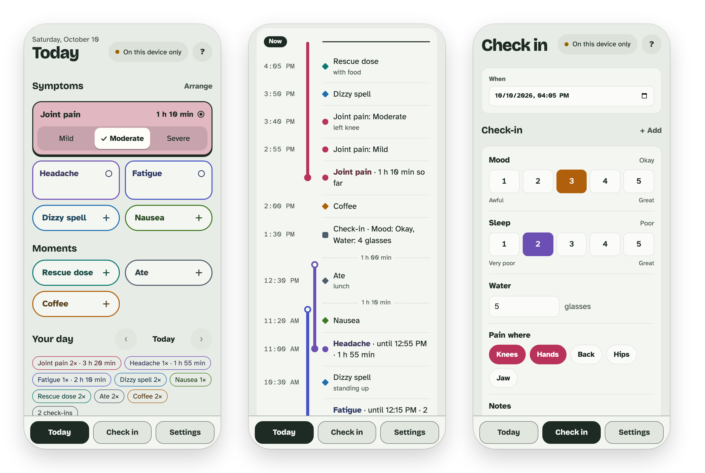

# Log Lightly

My symptoms change hour to hour and I couldn't find an app that did **everything** I needed it to do, so now here comes another one made for the frustrated "complex cases" who are hurting, yet somehow still expected to prove it's real. I'm tired, and I'm tired of getting ten minutes with a doctor and being told to come back in six months, in case the joint pain I've had for ten years magically goes away.

Every app I've tried makes me build an "entry" for everything. Right now I'm dozing off and it's getting harder to write this, but to log that I'd have to rate my mood first, as if I have the energy for that a dozen times a day.

Log Lightly is **one tap**.

- **Pain starts?** Tap *Pain*. It records until you tap it again. Rate the severity **in one tap** while it runs, and change it as it gets better or worse.
- **Took a rescue dose? Ate a snack? Fainted?** Tap it once and it's on the timeline.

Each tap lands on the timeline by itself the moment it happens. It changes all day, the same way I do. Because every tap is its own timestamped record, the data is ready to analyze. Export it to a spreadsheet anytime. It works offline, and can sync to your own private database.

<picture>
  <source media="(prefers-color-scheme: dark)" srcset="docs/screens-light.png">
  
</picture>

- **Today:** start/stop buttons for things that come and go (tap when it starts, tap again when it stops), one-tap moments, and the day's timeline. It's everything you logged, newest first, with each episode drawn as a bar alongside. Tap any entry to change its time or add a note.
- **Check in:** ratings, numbers, choices and notes. Every question is optional.
- **Settings:** add, rename, recolor, reorder, archive trackers, connect to a database, and export your data/restore a backup.

Your tracker names and entries are stored on your device or in your own Supabase project if you connect one.

---

## What you'll set up

1. **Supabase** (optional): your private database, so your entries sync between devices and have a copy online.
2. **Your phone:** add the app to your Home Screen and sign in.

---

## 1. Supabase

### Create the project
1. Go to [supabase.com](https://supabase.com), sign up, and click **New project**.
2. Give it a name and password.
3. Under **Security**, keep **Enable Data API** ticked: the app syncs through it. Leave **Automatically expose new tables** and **Enable automatic RLS** unticked. The setup SQL gives the app access to its own two tables and turns on their row security itself.

### Create the tables
1. Open **SQL Editor** and start a new query.
2. Paste in the whole of [`schema.sql`](schema.sql) and click **Run**.

It's safe to run again. When an update to the app changes the tables, the app says so and gives you the SQL to copy.

### Lock sign-ups and add yourself
1. Open **Authentication → Sign In / Providers**. Turn off **Allow new users to sign up**, so nobody else can make an account in your project, and make sure **Email** is enabled.
2. Open **Authentication → Users**. Click **Add user → Create new user**, enter your email and a strong password, and tick **Auto Confirm User**. This will be how you sign in to the app.

### Note your project's address and key
Click **Connect** at the top of your project, and note its **Project URL** (like `https://abcdefgh.supabase.co`) and its **publishable key**.

--- 

## 2. Your phone

1. Open the app's address in Safari, tap **Share**, then **Add to Home Screen**. (On Android, use Chrome's menu: **Add to Home screen**.)
2. From then on, always open Log Lightly from its Home Screen icon: Safari on its own can clear a site's data if you don't visit for a while.
3. To sync, go to **Settings → Sync**, paste the Project URL and key, and tap **Connect**. Then sign in with the email and password you added in Supabase.

---

## Your data

### Export
**Settings → Export for analysis** gives one `.zip` file.

### Export backup
**Settings → Export backup** saves all your trackers and entries as one JSON file. Deleted ones aren't in it.

### Restore backup
**Settings → Restore backup**, on a device that isn't connected to Supabase, replaces everything on it with a backup's trackers and entries. Before it changes anything, it says what's in the backup and how many entries on the device it doesn't have. If you connect Supabase afterwards, the restored data syncs like anything else logged on the device.

### Start over
**Settings → Start over** goes back to the starter trackers with no entries.
- **Reset this device** erases everything on it, including your sign-in. What's already synced stays in Supabase. Connect and sign in again to get it back.
- **Reset everywhere** (when signed in) deletes every tracker and entry in Supabase too, and your other devices follow at their next sync. It can't be undone.

---

## Working on the code

You need Node.js. Run these in this folder.

### Every day

| Command | What it does |
|---|---|
| `npm install` | Installs what the app needs. Once, and again after pulling changes that touch `package.json`. |
| `npm run dev` | Runs the app at the address it prints. Saving a file updates the page by itself. In its terminal: `r` + Enter restarts it, `o` + Enter opens the browser, `q` + Enter quits. Restart after `npm install`. |
| `npm run typecheck` | Checks the code for type errors without building. |
| `npm run build` | Builds the published version into `dist/` (GitHub does this for you on every push). |
| `npm run preview` | Serves the built `dist/` locally, to check the published version before pushing. |

### Tests

The tests need Python 3.12. Install what they use once (in a virtual environment, if you like):

```sh
python3 -m pip install -r tests/requirements.txt
python3 -m playwright install chromium
```

| Command | What it does |
|---|---|
| `npm test` | Builds, then runs everything below. GitHub runs this on every push and only publishes if it passes. |
| `npm run test:e2e` | Builds, then drives the app in a hidden browser against a fake Supabase. |
| `npm run test:schema` | Checks `schema.sql` in a throwaway database: that it's safe to run again, and its security rules. |

### Testing with a local Supabase

| Command | What it does |
|---|---|
| `npm run db:start` | Starts it (the first time downloads it, a few minutes) and loads `schema.sql` into a new database. Your local data is kept between starts. |
| `npm run db:stop` | Stops it. Data is kept for next time. |
| `npm run db:user -- you@example.com` | Adds a user you can sign in as (password `logbook-local`, or give one after the email), and prints the project URL and key to paste into the app. |
| `npm run db:apply` | Applies your latest `schema.sql` and keeps the data. Use this after changing `schema.sql`. |
| `npm run db:reset` | Wipes the local database and loads `schema.sql` fresh. Add your user again afterwards. |

To try it: `npm run db:start`, `npm run db:user -- me@example.com`, `npm run dev`, then in the app go to **Settings → Sync**, paste the URL and key, and sign in with that email and `logbook-local`.
